# Client Balance Management - Application Sequence Diagram

This diagram illustrates the complete flow of interactions within the Clean Architecture-based Node.js application for client balance management.

## Complete Application Flow Sequence Diagram

```mermaid
sequenceDiagram
    participant Client as 🌐 Client/Browser
    participant Express as 🚀 Express Server
    participant Middleware as 🛡️ Security/Auth Middleware
    participant Router as 🔀 Route Handler
    participant Controller as 🎮 Controller
    participant DIFactory as 🏭 DI Factory
    participant Container as 📦 IoC Container
    participant UseCase as 💼 Use Case
    participant Repository as 🗃️ Repository
    participant Mapper as 🔄 Entity Mapper
    participant Database as 💾 TypeORM/SQLite
    participant AuthService as 🔐 Auth Service
    participant ErrorHandler as ❌ Error Handler

    Note over Client, ErrorHandler: 🏁 Application Startup & Initialization
    Express->>Database: 🔌 Initialize TypeORM Connection
    Database-->>Express: ✅ Connection Established
    Express->>Express: 🛡️ Setup Security Middleware (Helmet, CORS, Rate Limiting)
    Express->>Express: 📝 Setup Request Processing (JSON, Validation, Logging)
    Express->>Express: 📚 Initialize Swagger Documentation
    Express->>Router: 🔗 Mount API Routes (/api)

    Note over Client, ErrorHandler: 🔐 Authentication Flow - User Registration
    Client->>Express: POST /api/auth/register
    Express->>Middleware: 🚦 Rate Limiting Check (Auth)
    Middleware-->>Express: ✅ Rate Limit OK
    Express->>Middleware: 🔍 Validate Request Body (Zod Schema)
    Middleware-->>Express: ✅ Validation Passed
    Express->>Router: 🎯 Route to Auth Handler
    Router->>DIFactory: 🏭 Get AuthController Instance
    DIFactory->>Container: 📦 Get AuthUseCase
    Container-->>DIFactory: 💼 Return AuthUseCase Instance
    DIFactory-->>Router: 🎮 Return AuthController
    Router->>Controller: 📝 Call register(req, res)
    Controller->>UseCase: 💼 Call authUseCase.register(data)
    UseCase->>Repository: 🔍 Check if user exists by email
    Repository->>Mapper: 🔄 Apply query filters
    Repository->>Database: 📊 SELECT user WHERE email = ?
    Database-->>Repository: 📋 Return query result
    Repository->>Mapper: 🔄 Map database entity to domain
    Mapper-->>Repository: 👤 Return domain User or null
    Repository-->>UseCase: 📊 Return existing user check
    UseCase->>AuthService: 🔐 Hash password
    AuthService-->>UseCase: 🔒 Return hashed password
    UseCase->>Repository: 💾 Create new user
    Repository->>Mapper: 🔄 Map domain to database entity
    Repository->>Database: 📝 INSERT INTO users
    Database-->>Repository: ✅ Return created user
    Repository->>Mapper: 🔄 Map database to domain entity
    Repository-->>UseCase: 👤 Return domain User
    UseCase->>AuthService: 🎫 Generate JWT token
    AuthService-->>UseCase: 🔑 Return JWT token
    UseCase-->>Controller: 📊 Return AuthResponse (token + user)
    Controller-->>Router: 📨 Send success response (201)
    Router-->>Express: 📤 Forward response
    Express-->>Client: 📋 JSON Response with token

    Note over Client, ErrorHandler: 🔐 Authentication Flow - User Login
    Client->>Express: POST /api/auth/login
    Express->>Middleware: 🚦 Rate Limiting Check
    Express->>Middleware: 🔍 Validate credentials
    Express->>Router: 🎯 Route to login handler
    Router->>Controller: 🔑 Call login method
    Controller->>UseCase: 💼 Execute login use case
    UseCase->>Repository: 🔍 Find user by email
    Repository->>Database: 📊 Query user table
    Database-->>Repository: 👤 Return user data
    UseCase->>AuthService: 🔐 Compare passwords
    AuthService-->>UseCase: ✅ Password match result
    UseCase->>AuthService: 🎫 Generate JWT token
    UseCase-->>Controller: 📊 Return auth response
    Controller-->>Client: 🔑 Send login response

    Note over Client, ErrorHandler: 🏦 Account Management Flow - Create Account
    Client->>Express: POST /api/accounts (with Bearer token)
    Express->>Middleware: 🛡️ Security checks
    Express->>Middleware: 🔍 JWT Authentication
    Middleware->>AuthService: 🎫 Verify JWT token
    AuthService-->>Middleware: ✅ Token valid, extract payload
    Middleware-->>Express: 👤 Add user to req.user
    Express->>Middleware: 🔐 Role authorization (client)
    Middleware-->>Express: ✅ Authorization passed
    Express->>Router: 🎯 Route to account handler
    Router->>Controller: 🏦 Call createAccount method
    Controller->>UseCase: 💼 Execute create account use case
    UseCase->>Repository: 🔍 Validate user exists
    Repository->>Database: 📊 Query user by ID
    Database-->>Repository: 👤 Return user data
    UseCase->>UseCase: 🔢 Generate unique account number
    UseCase->>Repository: 💾 Save new account
    Repository->>Mapper: 🔄 Map domain to database
    Repository->>Database: 📝 INSERT INTO accounts
    Database-->>Repository: ✅ Return created account
    Repository->>Mapper: 🔄 Map to domain entity
    Repository-->>UseCase: 🏦 Return account response
    UseCase-->>Controller: 📊 Return account data
    Controller-->>Client: 📋 JSON Response (201)

    Note over Client, ErrorHandler: 💰 Transaction Flow - Deposit Money
    Client->>Express: POST /api/accounts/{id}/deposit (with Bearer token)
    Express->>Middleware: 🛡️ Full security pipeline
    Express->>Middleware: 🔍 Validate account ID parameter
    Express->>Middleware: 🔍 Validate deposit amount
    Express->>Router: 🎯 Route to deposit handler
    Router->>Controller: 💰 Call deposit method
    Controller->>UseCase: 💼 Execute deposit use case
    UseCase->>Repository: 🔍 Find account by ID
    Repository->>Database: 📊 Query account
    Repository-->>UseCase: 🏦 Return account entity
    UseCase->>UseCase: ✅ Verify account ownership
    UseCase->>UseCase: 💰 Execute deposit on domain entity
    UseCase->>Repository: 💾 Update account balance
    Repository->>Database: 📝 UPDATE accounts SET balance
    Repository-->>UseCase: 🏦 Return updated account
    UseCase-->>Controller: 📊 Return transaction result
    Controller-->>Client: 💰 Success response

    Note over Client, ErrorHandler: 💸 Transaction Flow - Withdraw Money
    Client->>Express: POST /api/accounts/{id}/withdraw
    Express->>Middleware: 🛡️ Security & validation pipeline
    Express->>Router: 🎯 Route to withdraw handler
    Router->>Controller: 💸 Call withdraw method
    Controller->>UseCase: 💼 Execute withdraw use case
    UseCase->>Repository: 🔍 Find account by ID
    UseCase->>UseCase: ✅ Verify ownership & sufficient funds
    UseCase->>UseCase: 💸 Execute withdrawal on domain
    UseCase->>Repository: 💾 Update account balance
    UseCase-->>Controller: 📊 Return updated account
    Controller-->>Client: 💸 Withdrawal confirmation

    Note over Client, ErrorHandler: 👥 User Management Flow - Admin Operations
    Client->>Express: GET /api/users (with Admin token)
    Express->>Middleware: 🔍 JWT Authentication
    Express->>Middleware: 🔐 Admin role check
    Express->>Router: 🎯 Route to user list handler
    Router->>Controller: 👥 Call listUsers method
    Controller->>UseCase: 💼 Execute list users use case
    UseCase->>Repository: 📊 Find all users
    Repository->>Database: 📊 SELECT * FROM users
    Repository->>Mapper: 🔄 Map entities to domain
    Repository-->>UseCase: 👥 Return users list
    UseCase-->>Controller: 📊 Return user responses
    Controller-->>Client: 📋 Users list (admin only)

    Note over Client, ErrorHandler: ❌ Error Handling Flow
    alt Validation Error
        Middleware->>ErrorHandler: 🚨 Validation failed
        ErrorHandler-->>Client: 📋 400 Bad Request + details
    else Authentication Error
        Middleware->>ErrorHandler: 🚨 Auth failed
        ErrorHandler-->>Client: 📋 401 Unauthorized
    else Authorization Error
        Middleware->>ErrorHandler: 🚨 Insufficient permissions
        ErrorHandler-->>Client: 📋 403 Forbidden
    else Domain Business Logic Error
        UseCase->>ErrorHandler: 🚨 Business rule violation
        ErrorHandler-->>Client: 📋 400/409 + business error
    else Infrastructure Error
        Repository->>ErrorHandler: 🚨 Database error
        ErrorHandler-->>Client: 📋 500 Internal Server Error
    end

    Note over Client, ErrorHandler: 📊 Health Check & Monitoring
    Client->>Express: GET /health
    Express-->>Client: 📊 System status (uptime, memory, env)

    Note over Client, ErrorHandler: 📚 API Documentation
    Client->>Express: GET /api-docs
    Express-->>Client: 📚 Swagger UI Documentation
```



## Architecture Components Explanation

### 🏗️ **Clean Architecture Layers**

1. **🌐 Presentation Layer (Routes/Controllers)**
   - Express.js routes (`auth-routes.ts`, `account-routes.ts`, `user-routes.ts`)
   - Controllers handle HTTP concerns and delegate to use cases
   - Input validation and response formatting

2. **💼 Application Layer (Use Cases)**
   - Business logic orchestration
   - Use cases like `AuthUseCase`, `CreateAccountUseCase`, `AccountDepositUseCase`
   - No framework dependencies

3. **🏛️ Domain Layer (Entities/Rules)**
   - Core business entities (`User`, `Account`)
   - Domain validation and business rules
   - Framework-agnostic business logic

4. **🔧 Infrastructure Layer (External Concerns)**
   - Database access via TypeORM repositories
   - Authentication services (JWT)
   - External services and frameworks

### 🔄 **Key Design Patterns**

- **Dependency Injection**: DIFactory + Container pattern
- **Repository Pattern**: Abstract data access
- **Mapper Pattern**: Entity transformation between layers
- **Use Case Pattern**: Encapsulate business operations
- **Middleware Pattern**: Cross-cutting concerns (auth, validation, logging)

### 🛡️ **Security & Middleware Pipeline**

1. **Rate Limiting**: Prevents abuse (different limits for auth vs general)
2. **CORS**: Cross-origin resource sharing
3. **Helmet**: Security headers
4. **JWT Authentication**: Stateless token-based auth
5. **Role-based Authorization**: Admin vs Client permissions
6. **Input Validation**: Zod schema validation
7. **Request Sanitization**: XSS protection

### 📊 **Data Flow Summary**

```
Client Request → Security Middleware → Route Handler → Controller → 
Use Case → Repository → Database → Response Pipeline → Client
```

Each layer has clear responsibilities and dependencies flow inward (Clean Architecture principle), ensuring maintainable, testable, and scalable code.
