# Client Balance Management - Individual Flow Sequence Diagrams

This document provides detailed sequence diagrams for each specific flow in the Clean Architecture-based Node.js application.

## Table of Contents

1. [Application Startup Flow](#1-application-startup-flow)
2. [Authentication Flows](#2-authentication-flows)
   - [User Registration](#21-user-registration)
   - [User Login](#22-user-login)
   - [Get Current User](#23-get-current-user)
   - [User Logout](#24-user-logout)
3. [Account Management Flows](#3-account-management-flows)  - [Create Account](#31-create-account)
  - [Account Deposit](#32-account-deposit)
  - [Account Withdrawal](#33-account-withdrawal)
  - [Delete Account](#34-delete-account)
4. [User Management Flows](#4-user-management-flows)
   - [List Users (Admin)](#41-list-users-admin)
   - [Get User by ID](#42-get-user-by-id)
   - [Create User (Admin)](#43-create-user-admin)
   - [Update User](#44-update-user)
   - [Delete User (Admin)](#44-delete-user-admin)
5. [Error Handling Flow](#5-error-handling-flow)
6. [Security & Middleware Flow](#6-security--middleware-flow)

---

## 1. Application Startup Flow

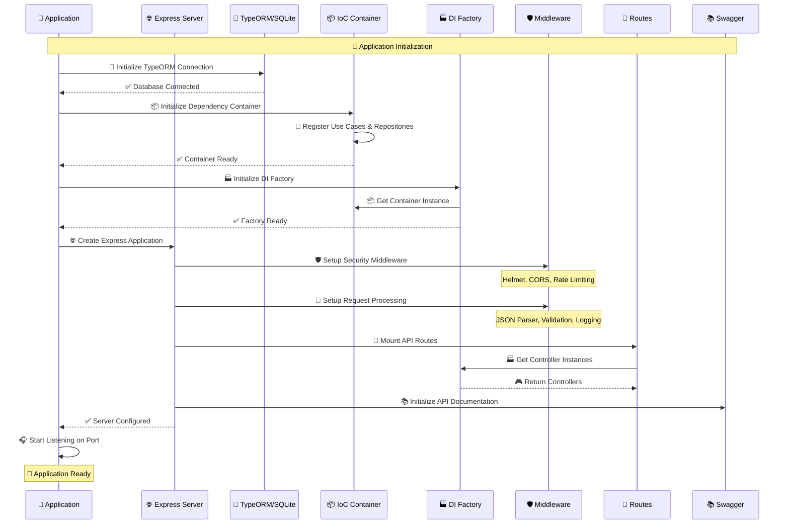
```mermaid
sequenceDiagram
    participant App as 🚀 Application
    participant Express as 🌐 Express Server
    participant Database as 💾 TypeORM/SQLite
    participant Container as 📦 IoC Container
    participant DIFactory as 🏭 DI Factory
    participant Middleware as 🛡️ Middleware
    participant Routes as 🔀 Routes
    participant Swagger as 📚 Swagger

    Note over App, Swagger: 🏁 Application Initialization
    
    App->>Database: 🔌 Initialize TypeORM Connection
    Database-->>App: ✅ Database Connected
    
    App->>Container: 📦 Initialize Dependency Container
    Container->>Container: 🔧 Register Use Cases & Repositories
    Container-->>App: ✅ Container Ready
    
    App->>DIFactory: 🏭 Initialize DI Factory
    DIFactory->>Container: 📦 Get Container Instance
    DIFactory-->>App: ✅ Factory Ready
    
    App->>Express: 🌐 Create Express Application
    Express->>Middleware: 🛡️ Setup Security Middleware
    Note over Middleware: Helmet, CORS, Rate Limiting
    Express->>Middleware: 📝 Setup Request Processing
    Note over Middleware: JSON Parser, Validation, Logging
    Express->>Routes: 🔀 Mount API Routes
    Routes->>DIFactory: 🏭 Get Controller Instances
    DIFactory-->>Routes: 🎮 Return Controllers
    Express->>Swagger: 📚 Initialize API Documentation
    
    Express-->>App: ✅ Server Configured
    App->>App: 🎧 Start Listening on Port
    Note over App: 🚀 Application Ready
```

---

## 2. Authentication Flows

### 2.1 User Registration

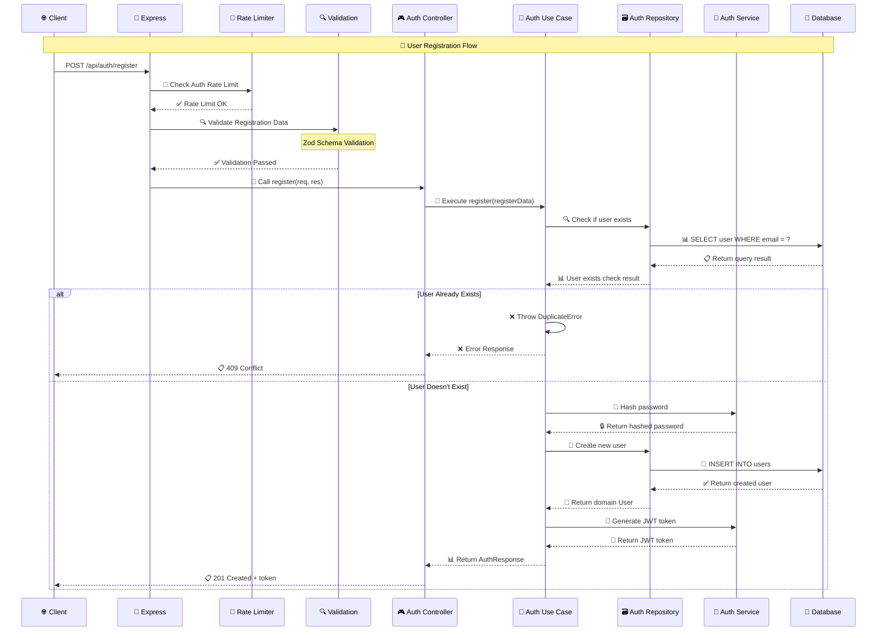
```mermaid
sequenceDiagram
    participant Client as 🌐 Client
    participant Express as 🚀 Express
    participant RateLimit as 🚦 Rate Limiter
    participant Validation as 🔍 Validation
    participant Controller as 🎮 Auth Controller
    participant UseCase as 💼 Auth Use Case
    participant Repository as 🗃️ Auth Repository
    participant AuthService as 🔐 Auth Service
    participant Database as 💾 Database

    Note over Client, Database: 🔐 User Registration Flow
    
    Client->>Express: POST /api/auth/register
    Express->>RateLimit: 🚦 Check Auth Rate Limit
    RateLimit-->>Express: ✅ Rate Limit OK
    
    Express->>Validation: 🔍 Validate Registration Data
    Note over Validation: Zod Schema Validation
    Validation-->>Express: ✅ Validation Passed
    
    Express->>Controller: 📝 Call register(req, res)
    Controller->>UseCase: 💼 Execute register(registerData)
    
    UseCase->>Repository: 🔍 Check if user exists
    Repository->>Database: 📊 SELECT user WHERE email = ?
    Database-->>Repository: 📋 Return query result
    Repository-->>UseCase: 📊 User exists check result
    
    alt User Already Exists
        UseCase->>UseCase: ❌ Throw DuplicateError
        UseCase-->>Controller: ❌ Error Response
        Controller-->>Client: 📋 409 Conflict
    else User Doesn't Exist
        UseCase->>AuthService: 🔐 Hash password
        AuthService-->>UseCase: 🔒 Return hashed password
        
        UseCase->>Repository: 💾 Create new user
        Repository->>Database: 📝 INSERT INTO users
        Database-->>Repository: ✅ Return created user
        Repository-->>UseCase: 👤 Return domain User
        
        UseCase->>AuthService: 🎫 Generate JWT token
        AuthService-->>UseCase: 🔑 Return JWT token
        
        UseCase-->>Controller: 📊 Return AuthResponse
        Controller-->>Client: 📋 201 Created + token
    end
```

### 2.2 User Login

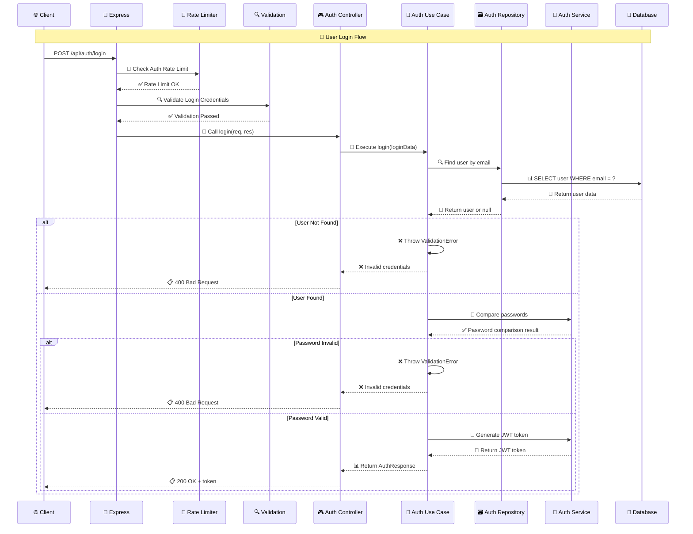
```mermaid
sequenceDiagram
    participant Client as 🌐 Client
    participant Express as 🚀 Express
    participant RateLimit as 🚦 Rate Limiter
    participant Validation as 🔍 Validation
    participant Controller as 🎮 Auth Controller
    participant UseCase as 💼 Auth Use Case
    participant Repository as 🗃️ Auth Repository
    participant AuthService as 🔐 Auth Service
    participant Database as 💾 Database

    Note over Client, Database: 🔑 User Login Flow
    
    Client->>Express: POST /api/auth/login
    Express->>RateLimit: 🚦 Check Auth Rate Limit
    RateLimit-->>Express: ✅ Rate Limit OK
    
    Express->>Validation: 🔍 Validate Login Credentials
    Validation-->>Express: ✅ Validation Passed
    
    Express->>Controller: 🔑 Call login(req, res)
    Controller->>UseCase: 💼 Execute login(loginData)
    
    UseCase->>Repository: 🔍 Find user by email
    Repository->>Database: 📊 SELECT user WHERE email = ?
    Database-->>Repository: 👤 Return user data
    Repository-->>UseCase: 👤 Return user or null
    
    alt User Not Found
        UseCase->>UseCase: ❌ Throw ValidationError
        UseCase-->>Controller: ❌ Invalid credentials
        Controller-->>Client: 📋 400 Bad Request
    else User Found
        UseCase->>AuthService: 🔐 Compare passwords
        AuthService-->>UseCase: ✅ Password comparison result
        
        alt Password Invalid
            UseCase->>UseCase: ❌ Throw ValidationError
            UseCase-->>Controller: ❌ Invalid credentials
            Controller-->>Client: 📋 400 Bad Request
        else Password Valid
            UseCase->>AuthService: 🎫 Generate JWT token
            AuthService-->>UseCase: 🔑 Return JWT token
            
            UseCase-->>Controller: 📊 Return AuthResponse
            Controller-->>Client: 📋 200 OK + token
        end
    end
```

### 2.3 Get Current User

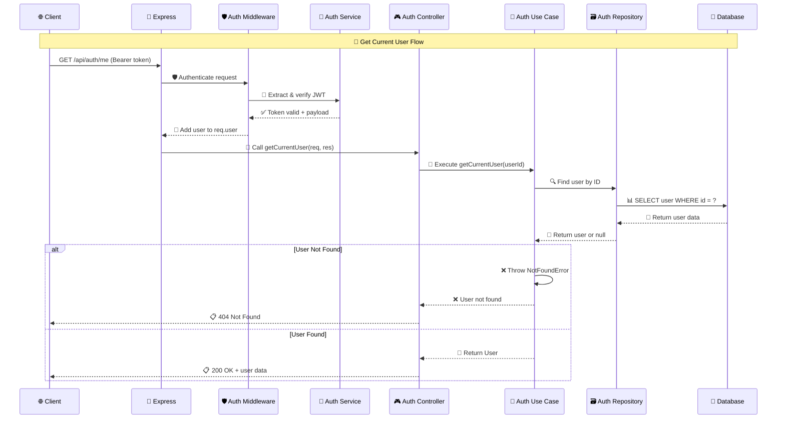
```mermaid
sequenceDiagram
    participant Client as 🌐 Client
    participant Express as 🚀 Express
    participant AuthMiddleware as 🛡️ Auth Middleware
    participant AuthService as 🔐 Auth Service
    participant Controller as 🎮 Auth Controller
    participant UseCase as 💼 Auth Use Case
    participant Repository as 🗃️ Auth Repository
    participant Database as 💾 Database

    Note over Client, Database: 👤 Get Current User Flow
    
    Client->>Express: GET /api/auth/me (Bearer token)
    Express->>AuthMiddleware: 🛡️ Authenticate request
    AuthMiddleware->>AuthService: 🎫 Extract & verify JWT
    AuthService-->>AuthMiddleware: ✅ Token valid + payload
    AuthMiddleware-->>Express: 👤 Add user to req.user
    
    Express->>Controller: 👤 Call getCurrentUser(req, res)
    Controller->>UseCase: 💼 Execute getCurrentUser(userId)
    
    UseCase->>Repository: 🔍 Find user by ID
    Repository->>Database: 📊 SELECT user WHERE id = ?
    Database-->>Repository: 👤 Return user data
    Repository-->>UseCase: 👤 Return user or null
    
    alt User Not Found
        UseCase->>UseCase: ❌ Throw NotFoundError
        UseCase-->>Controller: ❌ User not found
        Controller-->>Client: 📋 404 Not Found
    else User Found
        UseCase-->>Controller: 👤 Return User
        Controller-->>Client: 📋 200 OK + user data
    end
```

### 2.4 User Logout

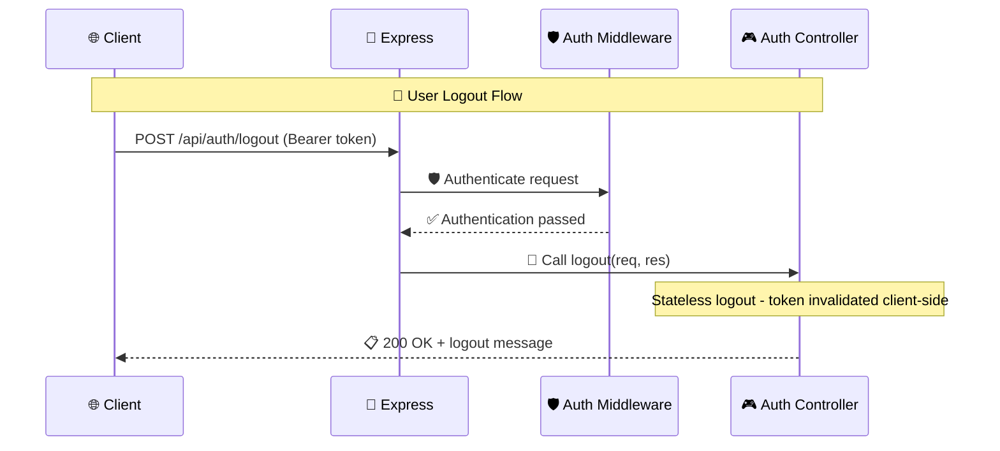
```mermaid
sequenceDiagram
    participant Client as 🌐 Client
    participant Express as 🚀 Express
    participant AuthMiddleware as 🛡️ Auth Middleware
    participant Controller as 🎮 Auth Controller

    Note over Client, Controller: 🚪 User Logout Flow
    
    Client->>Express: POST /api/auth/logout (Bearer token)
    Express->>AuthMiddleware: 🛡️ Authenticate request
    AuthMiddleware-->>Express: ✅ Authentication passed
    
    Express->>Controller: 🚪 Call logout(req, res)
    Note over Controller: Stateless logout - token invalidated client-side
    Controller-->>Client: 📋 200 OK + logout message
```

---

## 3. Account Management Flows

### 3.1 Create Account

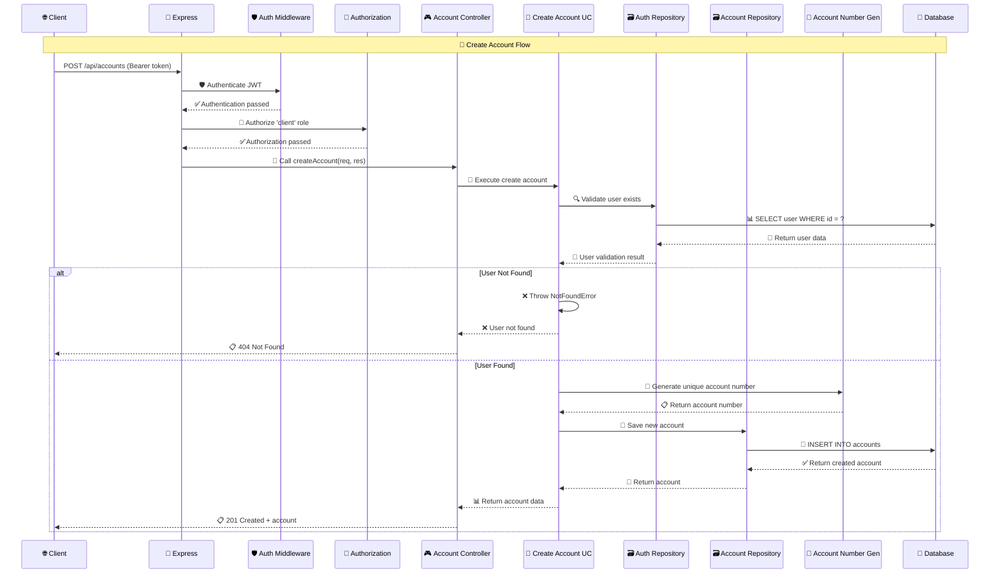
```mermaid
sequenceDiagram
    participant Client as 🌐 Client
    participant Express as 🚀 Express
    participant AuthMiddleware as 🛡️ Auth Middleware
    participant AuthzMiddleware as 🔐 Authorization
    participant Controller as 🎮 Account Controller
    participant UseCase as 💼 Create Account UC
    participant AuthRepo as 🗃️ Auth Repository
    participant AccountRepo as 🗃️ Account Repository
    participant Generator as 🔢 Account Number Gen
    participant Database as 💾 Database

    Note over Client, Database: 🏦 Create Account Flow
    
    Client->>Express: POST /api/accounts (Bearer token)
    Express->>AuthMiddleware: 🛡️ Authenticate JWT
    AuthMiddleware-->>Express: ✅ Authentication passed
    Express->>AuthzMiddleware: 🔐 Authorize 'client' role
    AuthzMiddleware-->>Express: ✅ Authorization passed
    
    Express->>Controller: 🏦 Call createAccount(req, res)
    Controller->>UseCase: 💼 Execute create account
    
    UseCase->>AuthRepo: 🔍 Validate user exists
    AuthRepo->>Database: 📊 SELECT user WHERE id = ?
    Database-->>AuthRepo: 👤 Return user data
    AuthRepo-->>UseCase: 👤 User validation result
    
    alt User Not Found
        UseCase->>UseCase: ❌ Throw NotFoundError
        UseCase-->>Controller: ❌ User not found
        Controller-->>Client: 📋 404 Not Found
    else User Found
        UseCase->>Generator: 🔢 Generate unique account number
        Generator-->>UseCase: 📋 Return account number
        
        UseCase->>AccountRepo: 💾 Save new account
        AccountRepo->>Database: 📝 INSERT INTO accounts
        Database-->>AccountRepo: ✅ Return created account
        AccountRepo-->>UseCase: 🏦 Return account
        
        UseCase-->>Controller: 📊 Return account data
        Controller-->>Client: 📋 201 Created + account
    end
```

### 3.2 Account Deposit

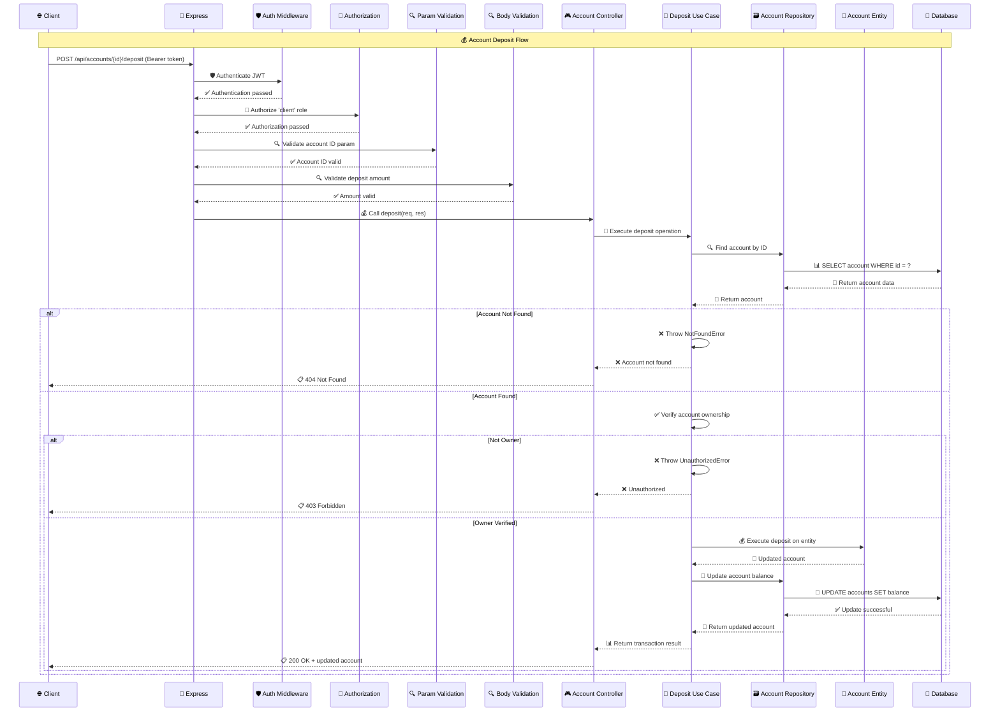
```mermaid
sequenceDiagram
    participant Client as 🌐 Client
    participant Express as 🚀 Express
    participant AuthMiddleware as 🛡️ Auth Middleware
    participant AuthzMiddleware as 🔐 Authorization
    participant ParamValidation as 🔍 Param Validation
    participant BodyValidation as 🔍 Body Validation
    participant Controller as 🎮 Account Controller
    participant UseCase as 💼 Deposit Use Case
    participant Repository as 🗃️ Account Repository
    participant Account as 🏦 Account Entity
    participant Database as 💾 Database

    Note over Client, Database: 💰 Account Deposit Flow
    
    Client->>Express: POST /api/accounts/{id}/deposit (Bearer token)
    Express->>AuthMiddleware: 🛡️ Authenticate JWT
    AuthMiddleware-->>Express: ✅ Authentication passed
    Express->>AuthzMiddleware: 🔐 Authorize 'client' role
    AuthzMiddleware-->>Express: ✅ Authorization passed
    Express->>ParamValidation: 🔍 Validate account ID param
    ParamValidation-->>Express: ✅ Account ID valid
    Express->>BodyValidation: 🔍 Validate deposit amount
    BodyValidation-->>Express: ✅ Amount valid
    
    Express->>Controller: 💰 Call deposit(req, res)
    Controller->>UseCase: 💼 Execute deposit operation
    
    UseCase->>Repository: 🔍 Find account by ID
    Repository->>Database: 📊 SELECT account WHERE id = ?
    Database-->>Repository: 🏦 Return account data
    Repository-->>UseCase: 🏦 Return account
    
    alt Account Not Found
        UseCase->>UseCase: ❌ Throw NotFoundError
        UseCase-->>Controller: ❌ Account not found
        Controller-->>Client: 📋 404 Not Found
    else Account Found
        UseCase->>UseCase: ✅ Verify account ownership
        alt Not Owner
            UseCase->>UseCase: ❌ Throw UnauthorizedError
            UseCase-->>Controller: ❌ Unauthorized
            Controller-->>Client: 📋 403 Forbidden
        else Owner Verified
            UseCase->>Account: 💰 Execute deposit on entity
            Account-->>UseCase: 🏦 Updated account
            
            UseCase->>Repository: 💾 Update account balance
            Repository->>Database: 📝 UPDATE accounts SET balance
            Database-->>Repository: ✅ Update successful
            Repository-->>UseCase: 🏦 Return updated account
            
            UseCase-->>Controller: 📊 Return transaction result
            Controller-->>Client: 📋 200 OK + updated account
        end
    end
```

### 3.3 Account Withdrawal

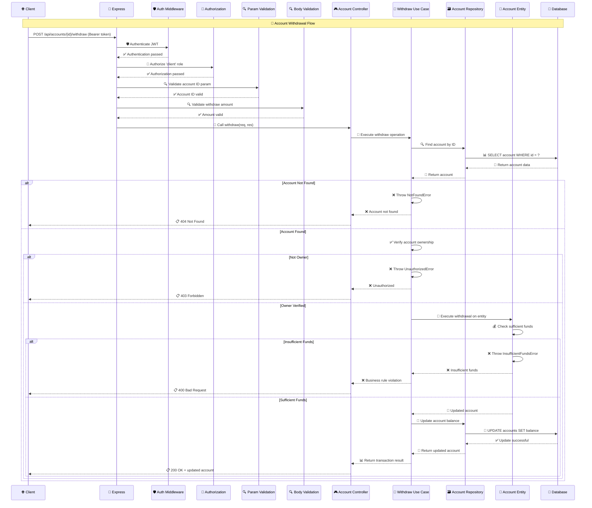
```mermaid
sequenceDiagram
    participant Client as 🌐 Client
    participant Express as 🚀 Express
    participant AuthMiddleware as 🛡️ Auth Middleware
    participant AuthzMiddleware as 🔐 Authorization
    participant ParamValidation as 🔍 Param Validation
    participant BodyValidation as 🔍 Body Validation
    participant Controller as 🎮 Account Controller
    participant UseCase as 💼 Withdraw Use Case
    participant Repository as 🗃️ Account Repository
    participant Account as 🏦 Account Entity
    participant Database as 💾 Database

    Note over Client, Database: 💸 Account Withdrawal Flow
    
    Client->>Express: POST /api/accounts/{id}/withdraw (Bearer token)
    Express->>AuthMiddleware: 🛡️ Authenticate JWT
    AuthMiddleware-->>Express: ✅ Authentication passed
    Express->>AuthzMiddleware: 🔐 Authorize 'client' role
    AuthzMiddleware-->>Express: ✅ Authorization passed
    Express->>ParamValidation: 🔍 Validate account ID param
    ParamValidation-->>Express: ✅ Account ID valid
    Express->>BodyValidation: 🔍 Validate withdraw amount
    BodyValidation-->>Express: ✅ Amount valid
    
    Express->>Controller: 💸 Call withdraw(req, res)
    Controller->>UseCase: 💼 Execute withdraw operation
    
    UseCase->>Repository: 🔍 Find account by ID
    Repository->>Database: 📊 SELECT account WHERE id = ?
    Database-->>Repository: 🏦 Return account data
    Repository-->>UseCase: 🏦 Return account
    
    alt Account Not Found
        UseCase->>UseCase: ❌ Throw NotFoundError
        UseCase-->>Controller: ❌ Account not found
        Controller-->>Client: 📋 404 Not Found
    else Account Found
        UseCase->>UseCase: ✅ Verify account ownership
        alt Not Owner
            UseCase->>UseCase: ❌ Throw UnauthorizedError
            UseCase-->>Controller: ❌ Unauthorized
            Controller-->>Client: 📋 403 Forbidden
        else Owner Verified
            UseCase->>Account: 💸 Execute withdrawal on entity
            Account->>Account: 💰 Check sufficient funds
            alt Insufficient Funds
                Account->>Account: ❌ Throw InsufficientFundsError
                Account-->>UseCase: ❌ Insufficient funds
                UseCase-->>Controller: ❌ Business rule violation
                Controller-->>Client: 📋 400 Bad Request
            else Sufficient Funds
                Account-->>UseCase: 🏦 Updated account
                
                UseCase->>Repository: 💾 Update account balance
                Repository->>Database: 📝 UPDATE accounts SET balance
                Database-->>Repository: ✅ Update successful
                Repository-->>UseCase: 🏦 Return updated account
                
                UseCase-->>Controller: 📊 Return transaction result
                Controller-->>Client: 📋 200 OK + updated account
            end
        end
    end
```

### 3.4 Delete Account

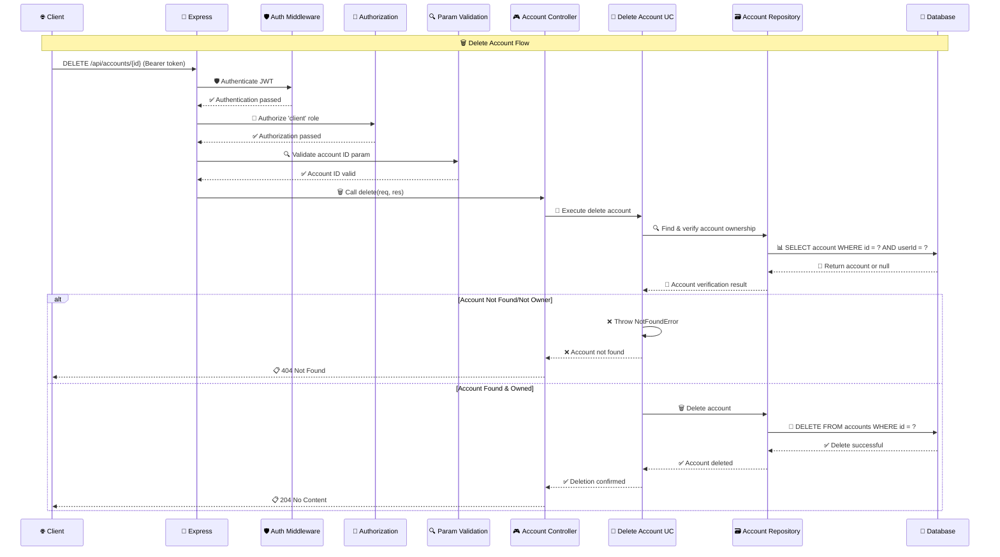
```mermaid
sequenceDiagram
    participant Client as 🌐 Client
    participant Express as 🚀 Express
    participant AuthMiddleware as 🛡️ Auth Middleware
    participant AuthzMiddleware as 🔐 Authorization
    participant ParamValidation as 🔍 Param Validation
    participant Controller as 🎮 Account Controller
    participant UseCase as 💼 Delete Account UC
    participant Repository as 🗃️ Account Repository
    participant Database as 💾 Database

    Note over Client, Database: 🗑️ Delete Account Flow
    
    Client->>Express: DELETE /api/accounts/{id} (Bearer token)
    Express->>AuthMiddleware: 🛡️ Authenticate JWT
    AuthMiddleware-->>Express: ✅ Authentication passed
    Express->>AuthzMiddleware: 🔐 Authorize 'client' role
    AuthzMiddleware-->>Express: ✅ Authorization passed
    Express->>ParamValidation: 🔍 Validate account ID param
    ParamValidation-->>Express: ✅ Account ID valid
    
    Express->>Controller: 🗑️ Call delete(req, res)
    Controller->>UseCase: 💼 Execute delete account
    
    UseCase->>Repository: 🔍 Find & verify account ownership
    Repository->>Database: 📊 SELECT account WHERE id = ? AND userId = ?
    Database-->>Repository: 🏦 Return account or null
    Repository-->>UseCase: 🏦 Account verification result
    
    alt Account Not Found/Not Owner
        UseCase->>UseCase: ❌ Throw NotFoundError
        UseCase-->>Controller: ❌ Account not found
        Controller-->>Client: 📋 404 Not Found
    else Account Found & Owned
        UseCase->>Repository: 🗑️ Delete account
        Repository->>Database: 📝 DELETE FROM accounts WHERE id = ?
        Database-->>Repository: ✅ Delete successful
        Repository-->>UseCase: ✅ Account deleted
        
        UseCase-->>Controller: ✅ Deletion confirmed
        Controller-->>Client: 📋 204 No Content
    end
```

---

## 4. User Management Flows

### 4.1 List Users (Admin)

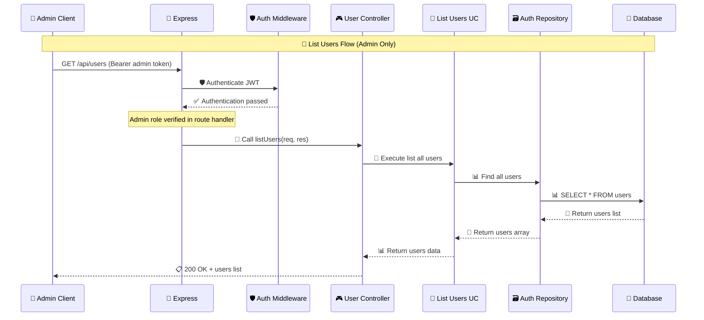
```mermaid
sequenceDiagram
    participant Admin as 👑 Admin Client
    participant Express as 🚀 Express
    participant AuthMiddleware as 🛡️ Auth Middleware
    participant Controller as 🎮 User Controller
    participant UseCase as 💼 List Users UC
    participant Repository as 🗃️ Auth Repository
    participant Database as 💾 Database

    Note over Admin, Database: 👥 List Users Flow (Admin Only)
    
    Admin->>Express: GET /api/users (Bearer admin token)
    Express->>AuthMiddleware: 🛡️ Authenticate JWT
    AuthMiddleware-->>Express: ✅ Authentication passed
    Note over Express: Admin role verified in route handler
    
    Express->>Controller: 👥 Call listUsers(req, res)
    Controller->>UseCase: 💼 Execute list all users
    
    UseCase->>Repository: 📊 Find all users
    Repository->>Database: 📊 SELECT * FROM users
    Database-->>Repository: 👥 Return users list
    Repository-->>UseCase: 👥 Return users array
    
    UseCase-->>Controller: 📊 Return users data
    Controller-->>Admin: 📋 200 OK + users list
```

### 4.2 Get User by ID

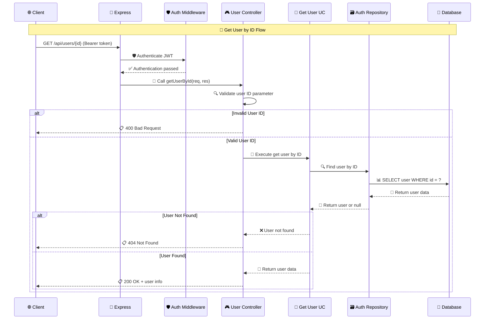
```mermaid
sequenceDiagram
    participant Client as 🌐 Client
    participant Express as 🚀 Express
    participant AuthMiddleware as 🛡️ Auth Middleware
    participant Controller as 🎮 User Controller
    participant UseCase as 💼 Get User UC
    participant Repository as 🗃️ Auth Repository
    participant Database as 💾 Database

    Note over Client, Database: 👤 Get User by ID Flow
    
    Client->>Express: GET /api/users/{id} (Bearer token)
    Express->>AuthMiddleware: 🛡️ Authenticate JWT
    AuthMiddleware-->>Express: ✅ Authentication passed
    
    Express->>Controller: 👤 Call getUserById(req, res)
    Controller->>Controller: 🔍 Validate user ID parameter
    
    alt Invalid User ID
        Controller-->>Client: 📋 400 Bad Request
    else Valid User ID
        Controller->>UseCase: 💼 Execute get user by ID
        
        UseCase->>Repository: 🔍 Find user by ID
        Repository->>Database: 📊 SELECT user WHERE id = ?
        Database-->>Repository: 👤 Return user data
        Repository-->>UseCase: 👤 Return user or null
        
        alt User Not Found
            UseCase-->>Controller: ❌ User not found
            Controller-->>Client: 📋 404 Not Found
        else User Found
            UseCase-->>Controller: 👤 Return user data
            Controller-->>Client: 📋 200 OK + user info
        end
    end
```

### 4.3 Create User (Admin)

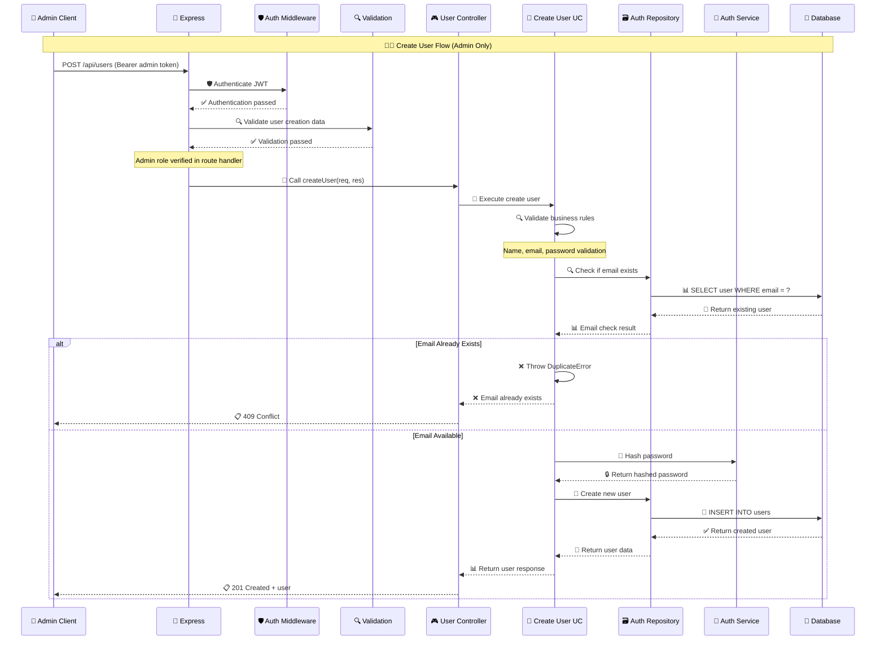
```mermaid
sequenceDiagram
    participant Admin as 👑 Admin Client
    participant Express as 🚀 Express
    participant AuthMiddleware as 🛡️ Auth Middleware
    participant Validation as 🔍 Validation
    participant Controller as 🎮 User Controller
    participant UseCase as 💼 Create User UC
    participant Repository as 🗃️ Auth Repository
    participant AuthService as 🔐 Auth Service
    participant Database as 💾 Database

    Note over Admin, Database: 👤➕ Create User Flow (Admin Only)
    
    Admin->>Express: POST /api/users (Bearer admin token)
    Express->>AuthMiddleware: 🛡️ Authenticate JWT
    AuthMiddleware-->>Express: ✅ Authentication passed
    Express->>Validation: 🔍 Validate user creation data
    Validation-->>Express: ✅ Validation passed
    Note over Express: Admin role verified in route handler
    
    Express->>Controller: 👤 Call createUser(req, res)
    Controller->>UseCase: 💼 Execute create user
    
    UseCase->>UseCase: 🔍 Validate business rules
    Note over UseCase: Name, email, password validation
    
    UseCase->>Repository: 🔍 Check if email exists
    Repository->>Database: 📊 SELECT user WHERE email = ?
    Database-->>Repository: 👤 Return existing user
    Repository-->>UseCase: 📊 Email check result
    
    alt Email Already Exists
        UseCase->>UseCase: ❌ Throw DuplicateError
        UseCase-->>Controller: ❌ Email already exists
        Controller-->>Admin: 📋 409 Conflict
    else Email Available
        UseCase->>AuthService: 🔐 Hash password
        AuthService-->>UseCase: 🔒 Return hashed password
        
        UseCase->>Repository: 💾 Create new user
        Repository->>Database: 📝 INSERT INTO users
        Database-->>Repository: ✅ Return created user
        Repository-->>UseCase: 👤 Return user data
        
        UseCase-->>Controller: 📊 Return user response
        Controller-->>Admin: 📋 201 Created + user
    end
```

### 4.4 Update User

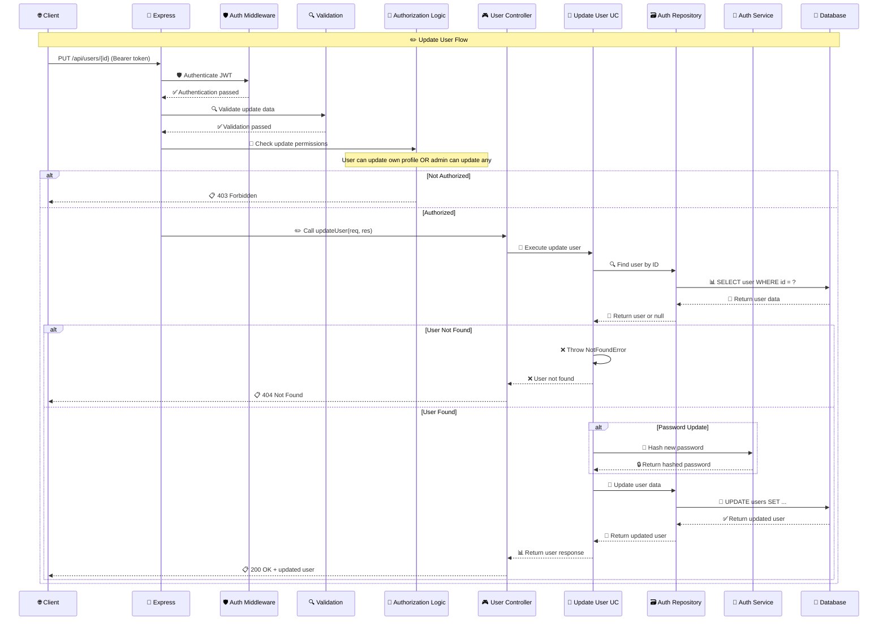
```mermaid
sequenceDiagram
    participant Client as 🌐 Client
    participant Express as 🚀 Express
    participant AuthMiddleware as 🛡️ Auth Middleware
    participant Validation as 🔍 Validation
    participant Authorization as 🔐 Authorization Logic
    participant Controller as 🎮 User Controller
    participant UseCase as 💼 Update User UC
    participant Repository as 🗃️ Auth Repository
    participant AuthService as 🔐 Auth Service
    participant Database as 💾 Database

    Note over Client, Database: ✏️ Update User Flow
    
    Client->>Express: PUT /api/users/{id} (Bearer token)
    Express->>AuthMiddleware: 🛡️ Authenticate JWT
    AuthMiddleware-->>Express: ✅ Authentication passed
    Express->>Validation: 🔍 Validate update data
    Validation-->>Express: ✅ Validation passed
    Express->>Authorization: 🔐 Check update permissions
    Note over Authorization: User can update own profile OR admin can update any
    
    alt Not Authorized
        Authorization-->>Client: 📋 403 Forbidden
    else Authorized
        Express->>Controller: ✏️ Call updateUser(req, res)
        Controller->>UseCase: 💼 Execute update user
        
        UseCase->>Repository: 🔍 Find user by ID
        Repository->>Database: 📊 SELECT user WHERE id = ?
        Database-->>Repository: 👤 Return user data
        Repository-->>UseCase: 👤 Return user or null
        
        alt User Not Found
            UseCase->>UseCase: ❌ Throw NotFoundError
            UseCase-->>Controller: ❌ User not found
            Controller-->>Client: 📋 404 Not Found
        else User Found
            alt Password Update
                UseCase->>AuthService: 🔐 Hash new password
                AuthService-->>UseCase: 🔒 Return hashed password
            end
            
            UseCase->>Repository: 💾 Update user data
            Repository->>Database: 📝 UPDATE users SET ...
            Database-->>Repository: ✅ Return updated user
            Repository-->>UseCase: 👤 Return updated user
            
            UseCase-->>Controller: 📊 Return user response
            Controller-->>Client: 📋 200 OK + updated user
        end
    end
```

### 4.4 Delete User (Admin)

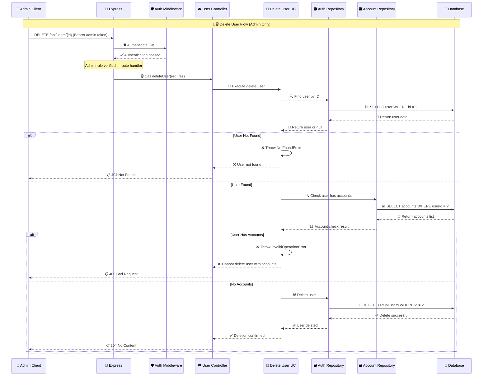
```mermaid
sequenceDiagram
    participant Admin as 👑 Admin Client
    participant Express as 🚀 Express
    participant AuthMiddleware as 🛡️ Auth Middleware
    participant Controller as 🎮 User Controller
    participant UseCase as 💼 Delete User UC
    participant AuthRepo as 🗃️ Auth Repository
    participant AccountRepo as 🗃️ Account Repository
    participant Database as 💾 Database

    Note over Admin, Database: 👤🗑️ Delete User Flow (Admin Only)
    
    Admin->>Express: DELETE /api/users/{id} (Bearer admin token)
    Express->>AuthMiddleware: 🛡️ Authenticate JWT
    AuthMiddleware-->>Express: ✅ Authentication passed
    Note over Express: Admin role verified in route handler
    
    Express->>Controller: 🗑️ Call deleteUser(req, res)
    Controller->>UseCase: 💼 Execute delete user
    
    UseCase->>AuthRepo: 🔍 Find user by ID
    AuthRepo->>Database: 📊 SELECT user WHERE id = ?
    Database-->>AuthRepo: 👤 Return user data
    AuthRepo-->>UseCase: 👤 Return user or null
    
    alt User Not Found
        UseCase->>UseCase: ❌ Throw NotFoundError
        UseCase-->>Controller: ❌ User not found
        Controller-->>Admin: 📋 404 Not Found
    else User Found
        UseCase->>AccountRepo: 🔍 Check user has accounts
        AccountRepo->>Database: 📊 SELECT accounts WHERE userId = ?
        Database-->>AccountRepo: 🏦 Return accounts list
        AccountRepo-->>UseCase: 📊 Account check result
        
        alt User Has Accounts
            UseCase->>UseCase: ❌ Throw InvalidOperationError
            UseCase-->>Controller: ❌ Cannot delete user with accounts
            Controller-->>Admin: 📋 400 Bad Request
        else No Accounts
            UseCase->>AuthRepo: 🗑️ Delete user
            AuthRepo->>Database: 📝 DELETE FROM users WHERE id = ?
            Database-->>AuthRepo: ✅ Delete successful
            AuthRepo-->>UseCase: ✅ User deleted
            
            UseCase-->>Controller: ✅ Deletion confirmed
            Controller-->>Admin: 📋 204 No Content
        end
    end
```

---

## 5. Error Handling Flow

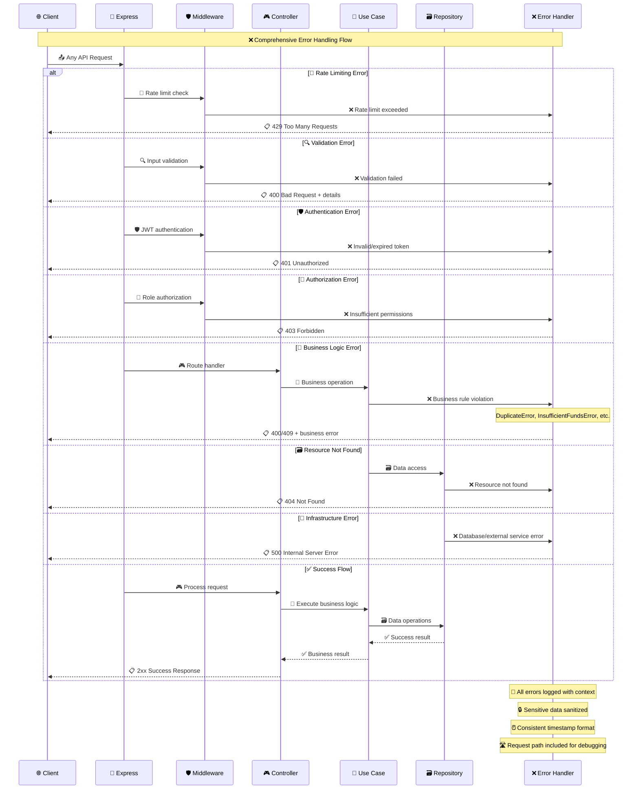
```mermaid
sequenceDiagram
    participant Client as 🌐 Client
    participant Express as 🚀 Express
    participant Middleware as 🛡️ Middleware
    participant Controller as 🎮 Controller
    participant UseCase as 💼 Use Case
    participant Repository as 🗃️ Repository
    participant ErrorHandler as ❌ Error Handler

    Note over Client, ErrorHandler: ❌ Comprehensive Error Handling Flow
    
    Client->>Express: 📤 Any API Request
    
    alt 🚦 Rate Limiting Error
        Express->>Middleware: 🚦 Rate limit check
        Middleware->>ErrorHandler: ❌ Rate limit exceeded
        ErrorHandler-->>Client: 📋 429 Too Many Requests
        
    else 🔍 Validation Error
        Express->>Middleware: 🔍 Input validation
        Middleware->>ErrorHandler: ❌ Validation failed
        ErrorHandler-->>Client: 📋 400 Bad Request + details
        
    else 🛡️ Authentication Error
        Express->>Middleware: 🛡️ JWT authentication
        Middleware->>ErrorHandler: ❌ Invalid/expired token
        ErrorHandler-->>Client: 📋 401 Unauthorized
        
    else 🔐 Authorization Error
        Express->>Middleware: 🔐 Role authorization
        Middleware->>ErrorHandler: ❌ Insufficient permissions
        ErrorHandler-->>Client: 📋 403 Forbidden
        
    else 💼 Business Logic Error
        Express->>Controller: 🎮 Route handler
        Controller->>UseCase: 💼 Business operation
        UseCase->>ErrorHandler: ❌ Business rule violation
        Note over ErrorHandler: DuplicateError, InsufficientFundsError, etc.
        ErrorHandler-->>Client: 📋 400/409 + business error
        
    else 🗃️ Resource Not Found
        UseCase->>Repository: 🗃️ Data access
        Repository->>ErrorHandler: ❌ Resource not found
        ErrorHandler-->>Client: 📋 404 Not Found
        
    else 💾 Infrastructure Error
        Repository->>ErrorHandler: ❌ Database/external service error
        ErrorHandler-->>Client: 📋 500 Internal Server Error
        
    else ✅ Success Flow
        Express->>Controller: 🎮 Process request
        Controller->>UseCase: 💼 Execute business logic
        UseCase->>Repository: 🗃️ Data operations
        Repository-->>UseCase: ✅ Success result
        UseCase-->>Controller: ✅ Business result
        Controller-->>Client: 📋 2xx Success Response
    end
    
    Note over ErrorHandler: 📝 All errors logged with context
    Note over ErrorHandler: 🔒 Sensitive data sanitized
    Note over ErrorHandler: ⏰ Consistent timestamp format
    Note over ErrorHandler: 🛣️ Request path included for debugging
```

---

## 6. Security & Middleware Flow

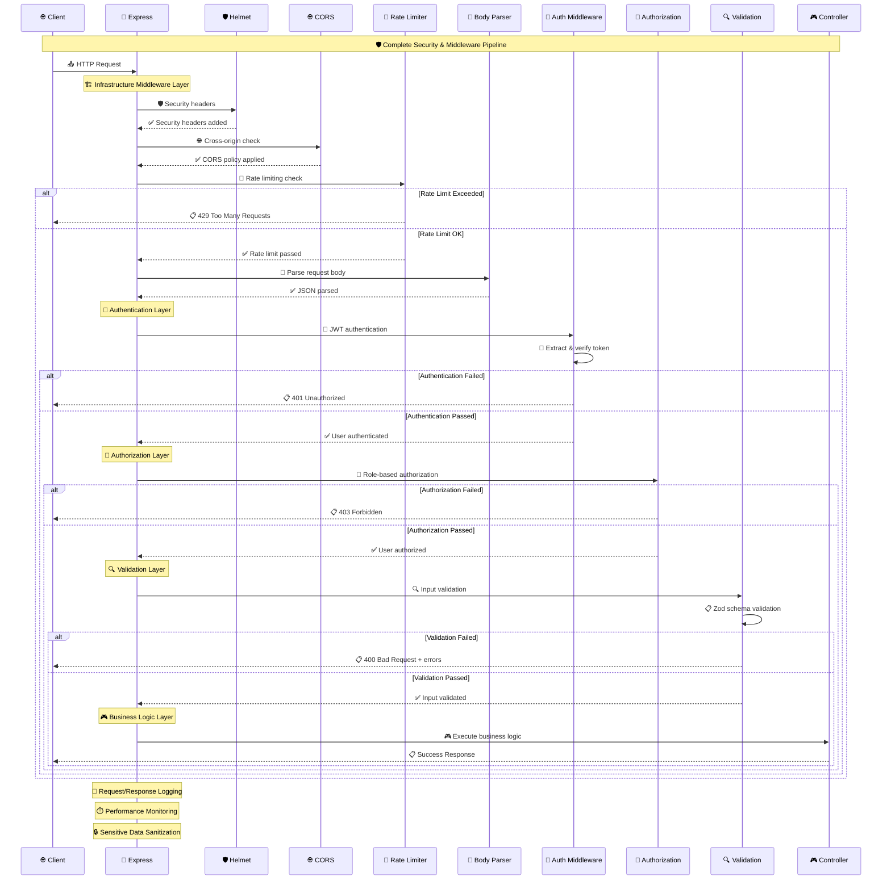
```mermaid
sequenceDiagram
    participant Client as 🌐 Client
    participant Express as 🚀 Express
    participant Helmet as 🛡️ Helmet
    participant CORS as 🌐 CORS
    participant RateLimit as 🚦 Rate Limiter
    participant BodyParser as 📝 Body Parser
    participant AuthMiddleware as 🔑 Auth Middleware
    participant AuthzMiddleware as 🔐 Authorization
    participant Validation as 🔍 Validation
    participant Controller as 🎮 Controller

    Note over Client, Controller: 🛡️ Complete Security & Middleware Pipeline
    
    Client->>Express: 📤 HTTP Request
    
    Note over Express: 🏗️ Infrastructure Middleware Layer
    Express->>Helmet: 🛡️ Security headers
    Helmet-->>Express: ✅ Security headers added
    Express->>CORS: 🌐 Cross-origin check
    CORS-->>Express: ✅ CORS policy applied
    Express->>RateLimit: 🚦 Rate limiting check
    
    alt Rate Limit Exceeded
        RateLimit-->>Client: 📋 429 Too Many Requests
    else Rate Limit OK
        RateLimit-->>Express: ✅ Rate limit passed
        Express->>BodyParser: 📝 Parse request body
        BodyParser-->>Express: ✅ JSON parsed
        
        Note over Express: 🔑 Authentication Layer
        Express->>AuthMiddleware: 🔑 JWT authentication
        AuthMiddleware->>AuthMiddleware: 🎫 Extract & verify token
        
        alt Authentication Failed
            AuthMiddleware-->>Client: 📋 401 Unauthorized
        else Authentication Passed
            AuthMiddleware-->>Express: ✅ User authenticated
            
            Note over Express: 🔐 Authorization Layer
            Express->>AuthzMiddleware: 🔐 Role-based authorization
            
            alt Authorization Failed
                AuthzMiddleware-->>Client: 📋 403 Forbidden
            else Authorization Passed
                AuthzMiddleware-->>Express: ✅ User authorized
                
                Note over Express: 🔍 Validation Layer
                Express->>Validation: 🔍 Input validation
                Validation->>Validation: 📋 Zod schema validation
                
                alt Validation Failed
                    Validation-->>Client: 📋 400 Bad Request + errors
                else Validation Passed
                    Validation-->>Express: ✅ Input validated
                    
                    Note over Express: 🎮 Business Logic Layer
                    Express->>Controller: 🎮 Execute business logic
                    Controller-->>Client: 📋 Success Response
                end
            end
        end
    end
    
    Note over Express: 📝 Request/Response Logging
    Note over Express: ⏱️ Performance Monitoring
    Note over Express: 🔒 Sensitive Data Sanitization
```

---

## Architecture Notes

### 🏗️ **Design Patterns Used**

- **Clean Architecture**: Clear separation of concerns across layers
- **Dependency Injection**: DI Factory + Container pattern
- **Repository Pattern**: Abstract data access layer
- **Use Case Pattern**: Encapsulated business operations
- **Middleware Pattern**: Cross-cutting concerns (auth, validation, logging)
- **Error Handler Pattern**: Centralized error processing

### 🔄 **Data Flow Summary**

```
Request → Security → Auth → Authorization → Validation → 
Controller → Use Case → Repository → Database → 
Response Pipeline → Client
```

### 🛡️ **Security Layers**

1. **Infrastructure Security**: Helmet, CORS, Rate Limiting
2. **Authentication**: JWT token verification
3. **Authorization**: Role-based access control
4. **Input Validation**: Zod schema validation
5. **Business Validation**: Domain rule enforcement
6. **Error Sanitization**: Sensitive data protection

### 📊 **Error Response Format**

```json
{
  "error": "Error Type",
  "message": "Human readable message",
  "details": { /* Additional context */ },
  "path": "/api/endpoint",
  "timestamp": "2025-01-08T10:30:00.000Z"
}
```

Each flow maintains the principles of Clean Architecture while ensuring comprehensive security, validation, and error handling throughout the application lifecycle.
